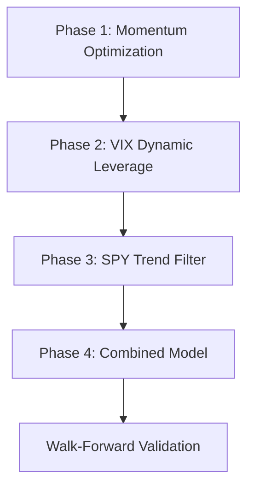

# EXP-002 Testing Sequence and Execution Plan

## Overview
Systematic testing approach to close the 1.33% CAGR gap between SectorRotationModel_v1 (13.01%) and SPY (14.34%).

## Testing Dependencies



## Phase 1: Momentum Period Optimization (Day 1)
**Objective**: Find optimal momentum lookback period
**Time Estimate**: 30-45 minutes
**Dependencies**: None

### Execution Order:
```bash
# 1. Baseline reference (already known)
python3 -m backtest.analyze_cli --profile sector_rotation_leverage_1.25x

# 2. Test shorter periods (potentially more responsive)
python3 -m backtest.analyze_cli --profile sector_rotation_mom_118
python3 -m backtest.analyze_cli --profile sector_rotation_mom_120
python3 -m backtest.analyze_cli --profile sector_rotation_mom_122
python3 -m backtest.analyze_cli --profile sector_rotation_mom_124

# 3. Test longer periods (potentially smoother)
python3 -m backtest.analyze_cli --profile sector_rotation_mom_128
python3 -m backtest.analyze_cli --profile sector_rotation_mom_130
python3 -m backtest.analyze_cli --profile sector_rotation_mom_132
python3 -m backtest.analyze_cli --profile sector_rotation_mom_134

# 4. Compare results
python3 -m backtest.cli show-last
```

### Decision Criteria:
- Select momentum period with highest BPS score
- If tie on BPS, prefer higher Sharpe ratio
- If still tied, prefer momentum closest to 126 (minimize change)

### Expected Outcome:
- Best momentum period identified
- Update Phase 2 profiles with this value

## Phase 2: VIX-Based Dynamic Leverage (Day 1-2)
**Objective**: Implement adaptive leverage based on market volatility
**Time Estimate**: 2-3 hours (includes model creation)
**Dependencies**: Best momentum period from Phase 1

### Prerequisites:
1. Create `models/sector_rotation_vix_v1.py` based on `sector_rotation_v1.py`
2. Add VIX data download if not available
3. Update profiles with best momentum period

### Model Implementation Requirements:
```python
# Pseudo-code for VIX scaling
vix_current = context.get_market_indicator('VIX')
vix_scale = min(30 / max(vix_current, 15), 2.0)  # Cap at 2x scale
dynamic_leverage = base_leverage * vix_scale
dynamic_leverage = max(min_leverage, min(dynamic_leverage, max_leverage))
```

### Execution Order:
```bash
# 1. Download VIX data if needed
python3 -m engines.data.cli download --symbols ^VIX --start 2020-01-01

# 2. Test leverage scaling
python3 -m backtest.analyze_cli --profile sector_rotation_vix_10
python3 -m backtest.analyze_cli --profile sector_rotation_vix_11
python3 -m backtest.analyze_cli --profile sector_rotation_vix_12
python3 -m backtest.analyze_cli --profile sector_rotation_vix_13
python3 -m backtest.analyze_cli --profile sector_rotation_vix_14

# 3. Analyze leverage utilization
python3 -m backtest.cli show-last
```

### Decision Criteria:
- Highest risk-adjusted returns (Sharpe > BPS for this phase)
- Max drawdown must not exceed -20%
- Average leverage utilization between 0.9x and 1.3x

## Phase 3: SPY Trend Confirmation Filter (Day 2)
**Objective**: Reduce drawdowns by avoiding bear markets
**Time Estimate**: 2 hours
**Dependencies**: Best config from Phase 2

### Prerequisites:
1. Create `models/sector_rotation_spy_filter_v1.py`
2. Ensure SPY data is available for MA calculations
3. Update profiles with Phase 1 & 2 best parameters

### Model Implementation Requirements:
```python
# Pseudo-code for SPY filter
spy_data = context.get_asset_features('SPY')
spy_ma = spy_data['close'].rolling(spy_ma_period).mean()
spy_uptrend = spy_data['close'][-1] > spy_ma[-1]

if require_spy_uptrend and not spy_uptrend:
    # Return zero weights (cash position)
    return {symbol: 0.0 for symbol in self.universe}
```

### Execution Order:
```bash
# 1. Ensure SPY data
python3 -m engines.data.cli download --symbols SPY --start 2019-01-01

# 2. Test different MA periods
python3 -m backtest.analyze_cli --profile sector_rotation_spy_150
python3 -m backtest.analyze_cli --profile sector_rotation_spy_200
python3 -m backtest.analyze_cli --profile sector_rotation_spy_250

# 3. Analyze time in market
python3 -m backtest.cli show-last
```

### Decision Criteria:
- Improved max drawdown (target < -15%)
- CAGR degradation < 0.5%
- Time invested > 60% (not too restrictive)

## Phase 4: Combined Optimization (Day 2-3)
**Objective**: Integrate all improvements into final model
**Time Estimate**: 1 hour
**Dependencies**: All previous phases completed

### Prerequisites:
1. Create `models/sector_rotation_combined_v2.py`
2. Integrate all three improvements
3. Update profile with all best parameters

### Execution:
```bash
# 1. Test combined model
python3 -m backtest.analyze_cli --profile sector_rotation_combined_v2

# 2. Compare to baseline
python3 -m backtest.cli show-last

# 3. Walk-forward validation (critical!)
python3 -m engines.optimization.walk_forward_cli --model SectorRotationCombined_v2 --quick
```

## Validation & Anti-Overfitting (Day 3)
**Objective**: Ensure improvements are robust, not overfit

### Tests:
1. **Walk-Forward Analysis** (already included above)
2. **Stability Test**: Run on 2018-2020 period (out-of-sample)
3. **Sensitivity Analysis**: ±10% on each parameter
4. **Monte Carlo**: Add noise to data, verify stability

```bash
# Out-of-sample test
python3 -m backtest.analyze_cli --profile sector_rotation_combined_v2 \
    --start 2018-01-01 --end 2020-01-01

# Sensitivity test (create temporary profiles)
# Test momentum_period ± 10%
# Test leverage ± 0.1x
# Test MA period ± 20 days
```

## Success Metrics

### Primary Goals:
- **CAGR**: ≥ 14.34% (match or beat SPY)
- **Sharpe**: > 1.7 (maintain or improve)
- **Max Drawdown**: < -18% (improve from -18.5%)
- **BPS**: > 0.85 (improve from 0.784)

### Secondary Goals:
- Win Rate > 60%
- Reduced volatility during market stress
- Lower correlation to SPY during drawdowns

## Risk Monitoring

### Red Flags (Stop Testing):
- Max drawdown exceeds -25%
- Sharpe ratio drops below 1.0
- CAGR drops below 11% (worse than baseline)
- Excessive parameter sensitivity (>2% CAGR change from 10% parameter change)

### Yellow Flags (Proceed Cautiously):
- Time in market < 50%
- Average leverage > 1.4x consistently
- High concentration in single sector > 60%

## Reporting Requirements

After each phase:
1. Update results table in `002_*_sector_rotation_improvements.md`
2. Document any unexpected behaviors
3. Note parameter sensitivities observed
4. Record computational time for each test

Final report must include:
1. Side-by-side comparison: baseline vs. final
2. Attribution analysis (which change contributed most)
3. Risk metrics comparison
4. Recommendation for production deployment

## Contingency Plans

### If Phase 1 shows no improvement:
- Expand range to 100-150 days
- Test non-linear momentum (e.g., weighted average)

### If VIX scaling degrades performance:
- Test alternative volatility measures (ATR, realized vol)
- Try inverse relationship (high VIX = defensive positioning)

### If SPY filter is too restrictive:
- Test shorter MAs (50D, 100D)
- Use momentum instead of MA
- Implement gradual scaling instead of binary filter

### If combined model underperforms:
- Test improvements individually in production
- Consider interaction effects between features
- Implement gradual rollout with position sizing

## Timeline

**Day 1**:
- Morning: Phase 1 momentum optimization
- Afternoon: Create VIX model, begin Phase 2

**Day 2**:
- Morning: Complete Phase 2, create SPY filter model
- Afternoon: Phase 3 testing, begin Phase 4

**Day 3**:
- Morning: Walk-forward validation
- Afternoon: Sensitivity analysis, final report

## Notes

- All tests use 2020-2024 period for consistency
- Transaction costs: 0.1% slippage + commission
- Rebalancing: Daily at market close
- Position limits: Max 40% per asset (risk engine enforced)
- Each test should complete in < 5 minutes