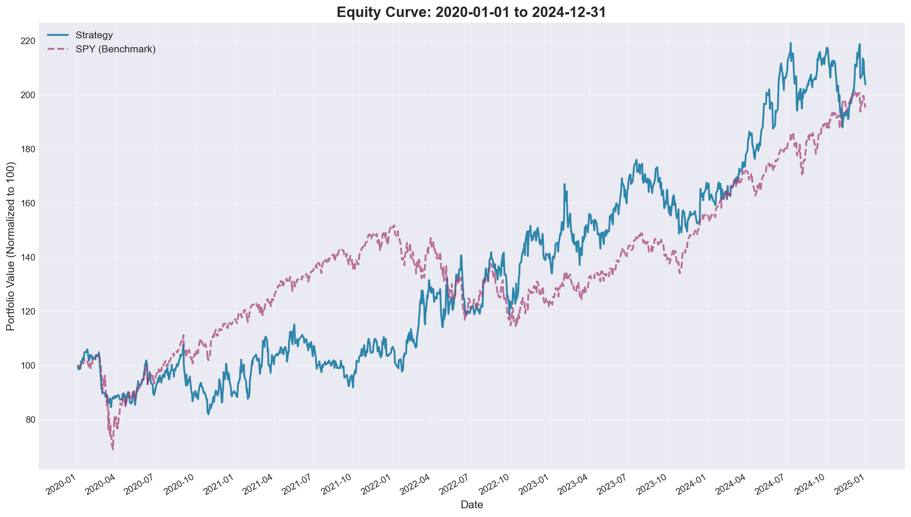
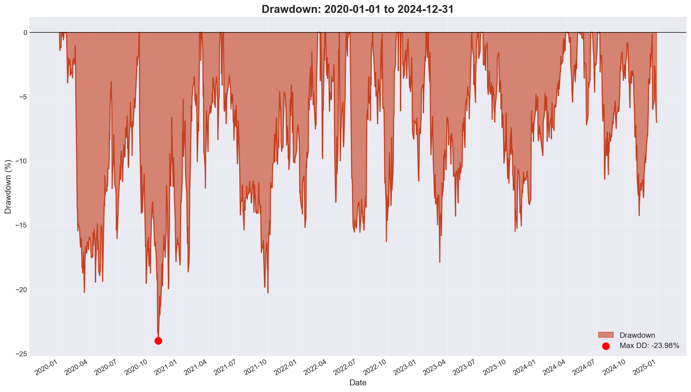
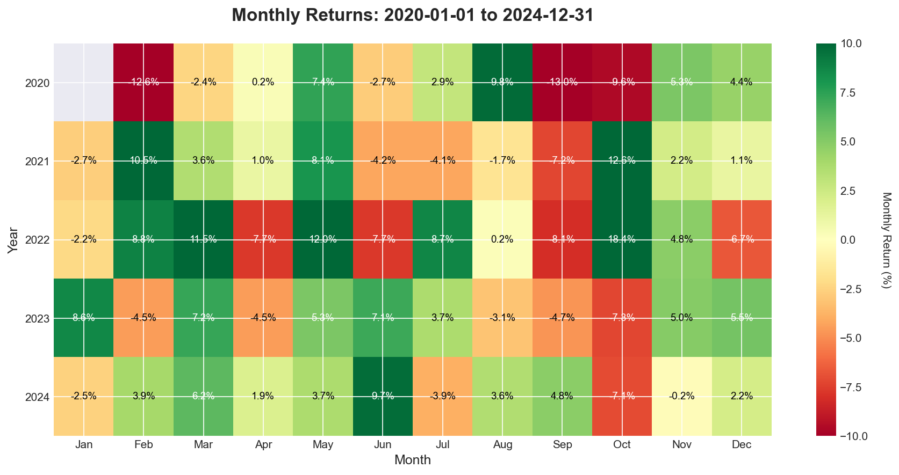

# V3: Crash Protection + Dip Buying

## Model
- **Name**: `SectorRotationConsistent_v3`
- **Profile**: `consistent_alpha_v3`
- **Date**: 2024-11-23

## Results

| Metric | Value |
|--------|-------|
| CAGR | 15.33% |
| Max DD | -23.98% |
| Sharpe | 1.904 |
| BPS | 0.883 |
| Trades | 1353 |
| Period | 2020-01-01 to 2024-12-31 |

**vs SPY**: Beats 14.34% CAGR benchmark

## Key Changes from V2

1. **Fast Crash Detection**
   - Trigger: SPY down >7% in 5 days OR VIX > 35
   - Action: Reduce to 25% exposure immediately

2. **Crash Mode**
   - Stay defensive while VIX > 25 or SPY below 10D MA
   - Protect capital, don't try to trade

3. **Dip Buying Mode**
   - Trigger: After 20%+ drawdown, VIX falling from >35 to <30
   - Action: Scale back in over 4 weeks (25% per week)

## Parameters

```yaml
crash_drop_threshold: -0.07
crash_drop_days: 5
vix_crash_threshold: 35
vix_recovery_threshold: 25
crash_exposure: 0.25
dip_buy_drawdown_threshold: -0.2
dip_buy_weeks: 4
bull_leverage: 1.2
bear_leverage: 1.0
momentum_period: 126
top_n_sectors: 4
```

## Analysis






## Key Achievement

**Max drawdown reduced by 12 percentage points** (36% → 24%) while still beating SPY.

Trade count reduced from 3207 → 1353 (more selective, defensive positioning during crashes).

## Infrastructure Fix

This version required implementing a **reference data provider** to give models access to SPY and VIX data without including them in the tradeable universe.

Files modified:
- `configs/base/system.yaml` - added `reference_assets`
- `engines/data/pipeline.py` - added `load_reference_data()`
- `backtest/runner.py` - load and merge reference data
- `backtest/analyze_cli.py` - added `system.reference_assets` to config

## Optimization Opportunities

1. **crash_exposure**: 25% may be too defensive → try 40-50%
2. **dip_buy_weeks**: 4 weeks may be too slow → try 2 weeks
3. **vix_crash_threshold**: 35 may be too late → try 30-40
4. **vix_recovery_threshold**: 25 may hold too long → try 30

## Files

- `analysis/` - Charts and reports
- `config/` - Profile configuration
- `logs/` - Backtest output
