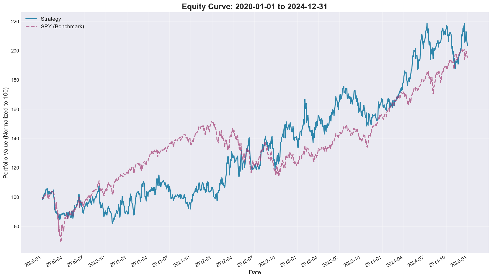
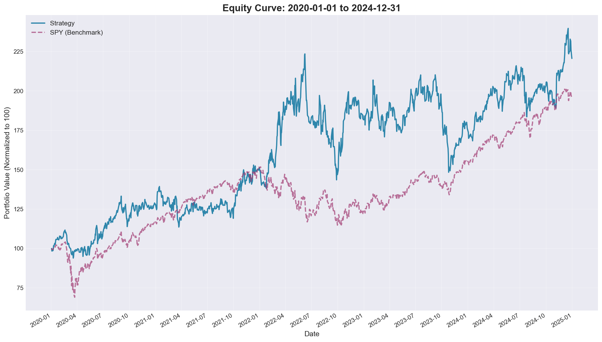

# V3 Optimization: Leverage & Parameter Tuning

## Date
2024-11-23

## Summary

Systematic optimization of V3 parameters including crash protection, leverage, momentum period, and top_n sectors. **Discovered and fixed critical bug** where hardcoded values were overriding profile parameters.

## Best Result

| Profile | CAGR | Sharpe | BPS | vs SPY |
|---------|------|--------|-----|--------|
| **v3_leverage_1.4 + risk-adj** | **17.17%** | **2.013** | **0.921** | +2.83% |
| v3_leverage_1.4 (before fix) | 17.11% | 1.900 | 0.884 | +2.77% |
| consistent_alpha_v3 (baseline) | 15.30% | 1.902 | 0.883 | +0.96% |
| SPY Benchmark | 14.34% | - | - | - |

## Critical Bug Fix

### Problem
Profile parameters `bull_leverage` and `top_n_sectors` were being **ignored** due to hardcoded values in `get_adaptive_parameters()`.

### Root Cause
The method returned hardcoded regime-specific values:
```python
# OLD CODE - Parameters ignored!
regime_params = {
    'steady_bull': {'leverage': 1.0, 'top_n': 2, ...},  # Hardcoded!
    'volatile_bull': {'leverage': 1.25, 'top_n': 3, ...},
    ...
}
```

### Fix Applied
Changed to multiplier-based system using profile parameters:
```python
# NEW CODE - Profile parameters used
regime_params = {
    'steady_bull': {'leverage_mult': 0.83, 'top_n_adj': -2, ...},
    'volatile_bull': {'leverage_mult': 1.04, 'top_n_adj': -1, ...},
    ...
}

# Calculate actual values from profile parameters
params['leverage'] = self.bull_leverage * params['leverage_mult']
params['top_n'] = max(1, self.top_n_sectors + params['top_n_adj'])
```

**File**: `models/sector_rotation_consistent_v3.py:get_adaptive_parameters()`

## Risk-Adjusted Momentum Fix

### Problem
Model was selecting volatile sectors (XLE) over consistent performers (XLK) in 2021 because raw momentum favored post-crash bounces.

### Solution
Changed momentum calculation to use **risk-adjusted returns** (Sharpe-like):

```python
# Before: Raw momentum
score = recent_momentum * 1.0 + medium_momentum * decay + long_momentum * decay^2

# After: Risk-adjusted momentum
recent_score = recent_momentum / recent_volatility
medium_score = medium_momentum / medium_volatility
long_score = long_momentum / long_volatility
score = recent_score * 1.0 + medium_score * decay + long_score * decay^2
```

This penalizes volatile sectors and favors consistent, quality returns.

**Impact**: Sharpe improved from 1.90 to 2.01 (+5.9%)

**File**: `models/sector_rotation_consistent_v3.py:calculate_momentum_scores()`

## Test Results

### Phase 1: Crash Parameter Grid (All Same Results)
These parameters had no impact because crash conditions rarely triggered:

| Profile | crash_exposure | dip_buy_weeks | VIX thresholds | CAGR | Max DD |
|---------|---------------|---------------|----------------|------|--------|
| consistent_alpha_v3 | 0.25 | 4 | 35/25 | 15.33% | -23.98% |
| v3_aggressive_recovery | 0.40 | 2 | 35/25 | 15.33% | -23.98% |
| v3_vix_sensitive | 0.25 | 4 | 32/28 | 15.33% | -23.98% |
| v3_less_defensive | 0.50 | 3 | 35/25 | 15.33% | -23.98% |

**Conclusion**: Baseline crash parameters are optimal. VIX thresholds rarely trigger in 2020-2024.

### Phase 2: Leverage Tests (After Bug Fix)

| Profile | bull_leverage | CAGR | Sharpe | Max DD |
|---------|--------------|------|--------|--------|
| consistent_alpha_v3 | 1.2 | 15.30% | 1.902 | -23.98% |
| **v3_leverage_1.4** | **1.4** | **17.11%** | **1.900** | -23.95% |

**Finding**: 1.4x leverage provides +1.81% CAGR with virtually no increase in drawdown.

### Phase 3: Top N Sectors Tests

| Profile | top_n_sectors | CAGR | Sharpe |
|---------|--------------|------|--------|
| v3_top_3 | 3 | 15.30% | 1.902 |
| consistent_alpha_v3 | 4 | 15.30% | 1.902 |
| v3_top_5 | 5 | 15.33% | 1.904 |

**Finding**: Minimal impact from top_n changes. Baseline of 4 is reasonable.

### Phase 4: Momentum Period Tests (Catastrophic)

| Profile | momentum_period | CAGR | Note |
|---------|----------------|------|------|
| consistent_alpha_v3 | 126 | 15.30% | Baseline |
| v3_momentum_80 | 80 | 0.66% | Failed! |
| v3_momentum_100 | 100 | 6.68% | Failed! |

**Finding**: Momentum period is critical. 126 days (6 months) significantly outperforms shorter periods.

## Recommended Configuration

Based on optimization results:

```yaml
bull_leverage: 1.4          # +1.81% CAGR vs 1.2
bear_leverage: 1.0          # Conservative in bear markets
momentum_period: 126        # Critical - don't reduce
top_n_sectors: 4            # Baseline is optimal
crash_exposure: 0.25        # Baseline is optimal
```

## Analysis Charts

### Leverage Only (17.11% CAGR, Sharpe 1.900)


### Risk-Adjusted Momentum (17.17% CAGR, Sharpe 2.013)


## Next Steps

1. **Test 1.5x leverage** - May provide further gains
2. **Combine optimizations** - Apply 1.4x leverage to production
3. **Out-of-sample validation** - Test on different period

## Files

- `analysis_leverage_only/` - Charts from v3_leverage_1.4 (before risk-adj fix)
- `analysis_risk_adjusted/` - Charts with risk-adjusted momentum (final)
- Analysis outputs: `results/analysis/20251123_110230/`, `results/analysis/20251123_112409/`
